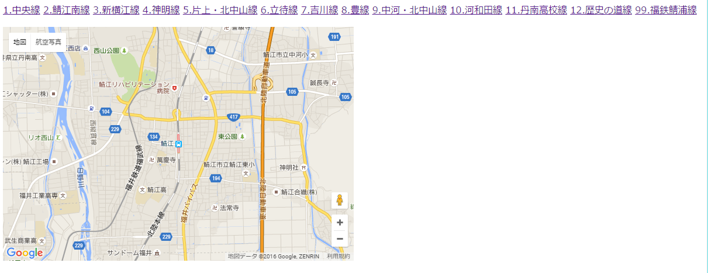

# 3.3 コミュニティバスの位置表示

## 3.3.1 シナリオの対象
コミュニティバスの利用者

## 3.3.2 サービス
### 3.3.2.1 概要
交通状況によっては、バスが定時に到着しない場合がある。このため、バスの現在位置情報を提供している事業者が多い。これをバスロケという。

このバスロケ情報を利用して、現在のバスの位置と、現在地付近に到着しそうか知りたい。

### 3.3.2.2 具体的な方法
鯖江市が運営する [つつじバス](http://www.city.sabae.fukui.jp/users/tutujibus/) は、バスロケ情報をリアルタイムに取得するAPIを提供している。これを利用して、現在のバスの位置と、現在地付近に到着しそうな時点で通知するシステムを構築する。

#### 3.3.2.2.1 ツールの準備
以下の2つのツールを準備する。  
* Google Maps AP（[Google APIs Console](https://code.google.com/apis/console) に登録して利用）
　　*  詳細については[ツール集のGoogle Maps項](../tools/tools-gmap.md) も参照のこと。

* [jQuery](https://jquery.com/) 

#### 3.3.2.2.2 Google Maps による地図の表示
Google Maps APIを利用して地図を表示する手法については、[ツール集のGoogle Maps項](../tools/tools-gmap.md) を参照のこと。ここでは、[ツール集のGoogle Maps項](../tools/tools-gmap.md) のサンプルプログラムに、つつじバスのWeb APIによるバスロケ情報取得機能を書き足していく。

地図の中心を鯖江駅にする．鯖江駅の緯経度は、[Geocoding](http://www.geocoding.jp/) により入手でき、その結果は北緯35.943451°、東経136.188843°である。

#### 3.3.2.2.3 APIによるバスの位置取得
つつじバスの [路線と便を指定したバスの位置データ仕様](http://www.city.sabae.fukui.jp/users/tutujibus/web-api/04.html) に基づいて、各線のバスの現在位置を取得するコードをJavascriptで記述する。  
このAPIを利用するためには、路線番号と便番号が必要である。路線番号は、 [路線番号データ](http://www.city.sabae.fukui.jp/users/tutujibus/web-api/03.html) APIにより取得できる。今回はこれを静的な情報として事前にコードに取り込んでおく。

便番号は、[路線毎の時刻表データ](http://www.city.sabae.fukui.jp/users/tutujibus/web-api/02.html) APIにより取得できる。これによると、バスは第1便から最大第20便まであることがわかる。

ここで、JQueryを利用してJSONPに基づくリクエストを出すためには、呼び出しURLの末尾に `?callback=?` を追加する。これがない場合、XSS（クロスサイトスクリプティング）の制限により、API1を呼び出すことができない。

これらのことから、指定された路線番号 `rosenid` のバスが走っている場合、その位置をピンで表示するコードは、以下のようになる。

    function dispBus( rosenid ) {
      // 地図を表示
          var params = {
            zoom: 14,
            center: new google.maps.LatLng(35.943451,136.188843),
            mapTypeId: google.maps.MapTypeId.ROADMAP
          };
          var map = new google.maps.Map(document.getElementById("sample_map"), params);
          // つつじバスのWeb APIからバスの位置を取得。バスが走っていたらその位置を表示
          // ※ urlの末尾に "?callback=?" をつけているのは、JSONPに基づいてAPIを発行するため。
          var url = 'http://tutujibus.com/rosenLookup.php?callback=?';
          for (var i=0; i<20; i++) {
            $.getJSON(url, {rosenid: rosenid, binid: i}, function(ret){
              if (ret.isRunning) {
                 var busPos = new google.maps.LatLng(ret.latitude, ret.longitude);
                 var marker = new google.maps.Marker({
                   position: busPos,
                   map: map,
                   title: "bus"});
              }
            });
          }
    }

#### 3.2.2.2.4 バスの近接判定
端末の現在位置は、`navigator.geolocation.getCurrentPosition()` 関数で取得できる。  
また、2点間の距離は、 `google.maps.geometry.spherical.computeDistanceBetween()` 関数で取得できる。ただし、この関数を利用するためには、Google Maps APIのJavaScriptを呼び出す際の引数に `library=libraries=geometry` が必要である。

バスが現在地の周辺500m以内にいた場合に、画面にアラートを出すコードは、以下のように記述できる。

             if (navigator.geolocation) {
               navigator.geolocation.getCurrentPosition(function(pos){
                 if (google.maps.geometry.spherical.computeDistanceBetween(pos, busPos) < 500) {
                   alert("近くにバスが来ました");
                 }
               }, null);
             }

#### 3.2.2.2.5 結果
路線を選択したときに、その路線を走るバスの位置を地図上に表示し、それが現在地の周辺にいれば画面にアラートを出すWebアプリの[サンプルプロクラム](samples/community-bus/sample-bus.html) と、その結果を示す。  
サンプルプログラム内の `__APIKEY__` を、Googleより取得したAPIキーに置き換えること。

## 3.2.3 使用するデータ
* つつじバス [路線番号データ](http://www.city.sabae.fukui.jp/users/tutujibus/web-api/02.html)
* つつじバス [路線毎の時刻表データ](http://www.city.sabae.fukui.jp/users/tutujibus/web-api/03.html)
* つつじバス [路線と便を指定したバスの位置データ](http://www.city.sabae.fukui.jp/users/tutujibus/web-api/04.html)

## 3.2.4 技術面での課題
* Google Maps APIを利用した地図の表示とピンの登録
* APIを利用したリアルタイムデータの取得
* JSONPを利用したAPI接続
* GeoCoding

## 3.2.5 ガバナンス面での課題

## 3.2.6 応用例
