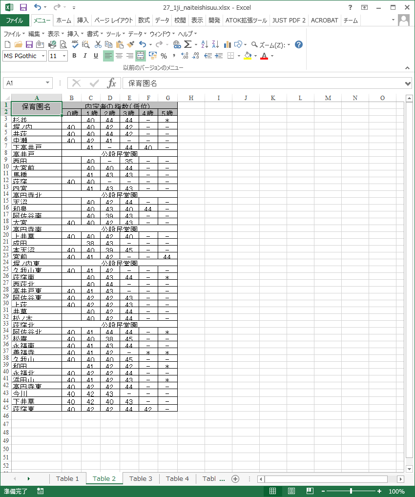
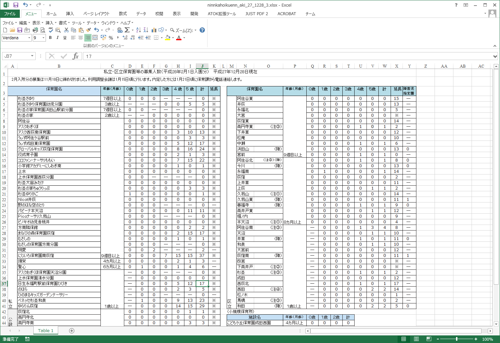
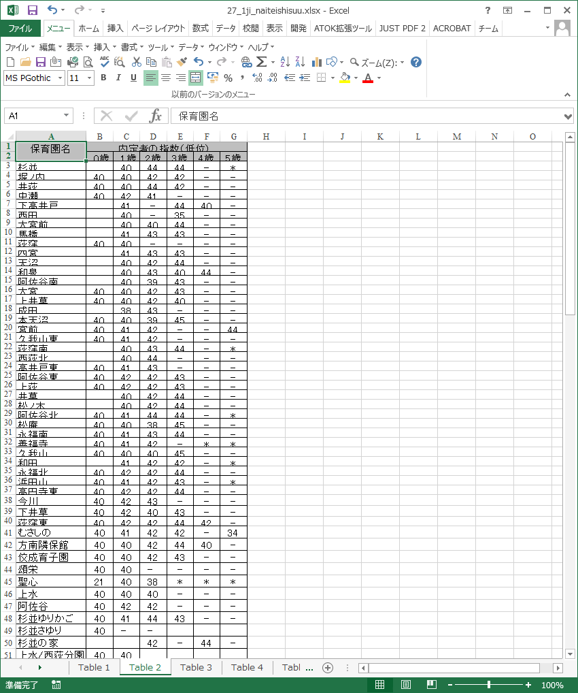
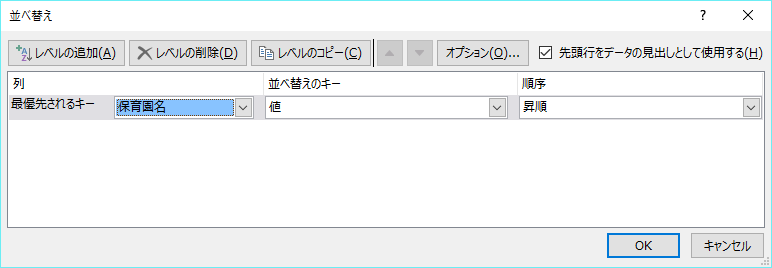
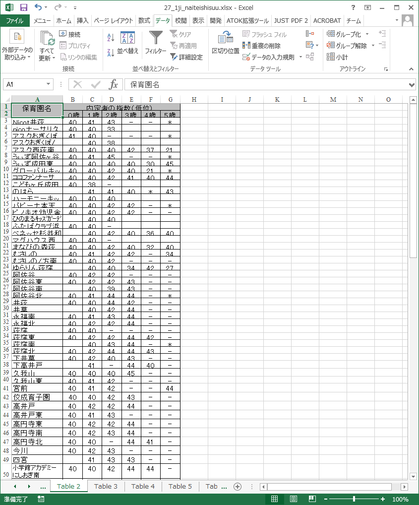
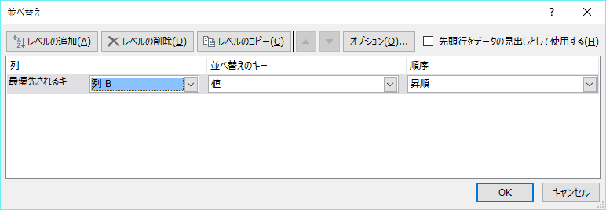
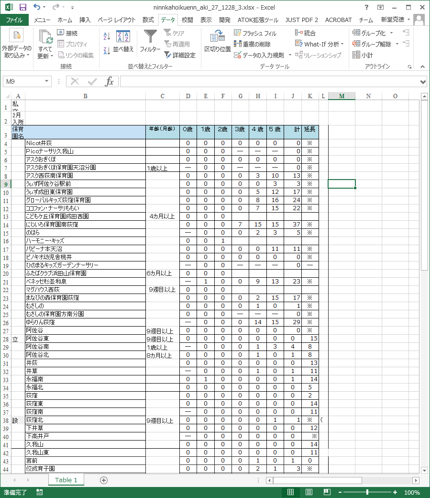
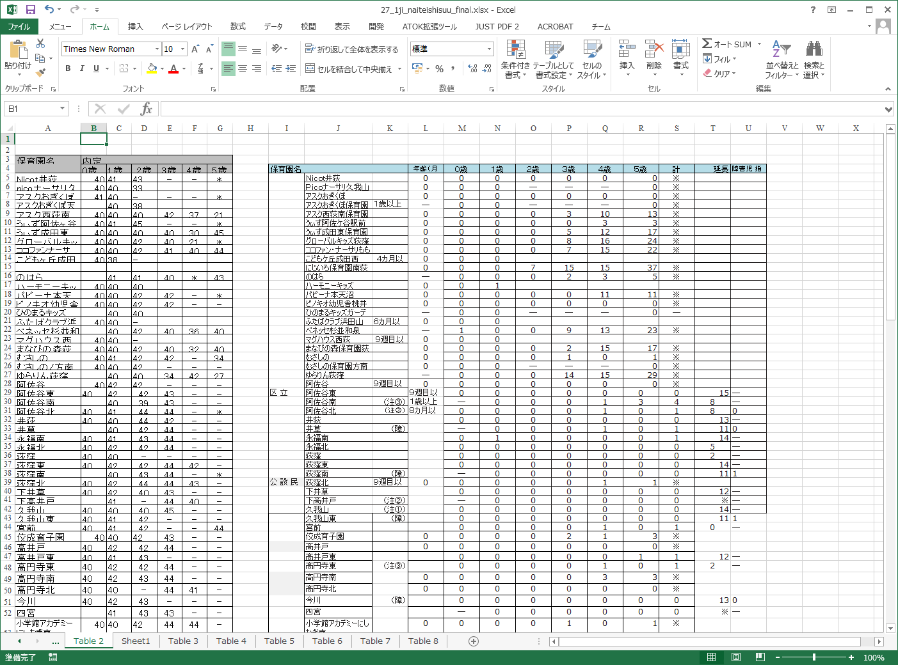
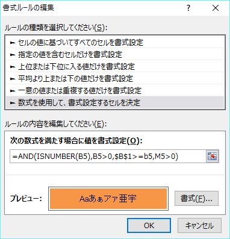
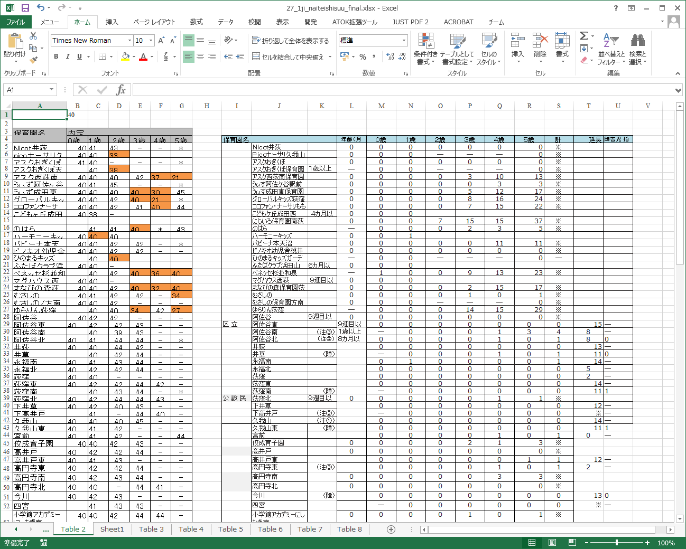

# 3.2 保育所探し

## 3.2.1 シナリオの対象
認可保育園への入所を希望する親御さん

## 3.2.2 サービス
### 3.2.2.1 概要
保育園とは、保護者がいろいろな都合で、家庭でお子さんの保育ができない場合に、保護者に代わって保育をする児童福祉施設である。
「家庭でお子さんの保育ができない」度合いを自治体ごとに定めており（これを「指数」ということが多い）、この指数が高いほど認可保育園に入りやすくなる。
自治体によっては、認可保育園の定員や、保育園入園の内定指数（内定を得られた最低の指数）を公開している。

杉並区に在住する親御さんが、杉並区が公開しているデータを使って、自分の子供を入園できる可能性のある認可保育園がどれくらいあるか、調べたい。

### 3.2.2.2 具体的な方法
#### 3.2.2.2.1 データの取得
杉並区は、webページ上で以下のデータを公開している。

* [認可保育所の定員(平成28年2月1日入所分）](http://www2.city.suginami.tokyo.jp/guide/detail/13349/ninnkahoikuenn_aki_27_1228_3.pdf)
* [平成27年4月保育園内定指数](http://www2.city.suginami.tokyo.jp/news/detail/17235/27_1ji_naiteishisuu.pdf)

また、指数は[保育施設利用のご案内](http://www2.city.suginami.tokyo.jp/guide/detail/13521/hoikuen_annai2804_2902_3.pdf)冊子に掲載されている。この冊子の記載に従って、自分の家庭の指数を再出する。

#### 3.2.2.2.2 データをExcelに変換
公開されているデータはPDF形式である。このままでは処理が難しいため、Excelに変換する。
[Smallpdf](http://smallpdf.com/jp/pdf-to-excel)、[Renee PDF Aide](http://www.reneelab.jp/pdf-converter)などのツールを利用すると、PDF形式のファイルをExcelに変換できる。

#### 3.2.2.2.3 データの整形
変換されたデータは、複数のシートに分割されている。また、複数の表が同一シートに存在している。
   
図 内定指数表の初期状態

   
図 定員表の初期状態

これらの表を、一列に並べる。その際、セルの結合を解除しておくと作業しやすい。

   
図 シートに分かれた内定指数表を並べる

一列に並べたら、昇順に並び替える。

   
図 内定指数表の並び換え条件

   
図 整形後の内定指数表

   
図 定員表の並び換え条件

   
図 整形後の定員表

そして、整形された表を横に並べる。

   
図 内定指数表と定員表をドッキング

#### 3.2.2.2.4 条件付き書式を利用して入所の可能性のある認可保育園をハイライト
自分の家庭の指数はB1セルに記載するものとする。

内定指数表の全体を選択し、「ホーム」→「条件付き書式」→「新しいルール」を選択する。
入所の可能性のある認可保育園の条件は、以下の通りである。

* 定員が0より大きい
* 指数が自分の家庭の指数以下である

指数値には空欄や数値でないものが含まれていることから、B5セルに記載すべき条件は以下のようになる。

=AND(ISNUMBER(B5),B5>0,$B$1>=B5,M5>0)

   
図 条件付き書式のルール

これにより、B1セルに自分の家庭の指数を入力すると、入所の可能性のある認可保育園をハイライトできる。

   
図 検索結果画面

## 3.2.3 使用するデータ
* [認可保育所の定員(平成28年2月1日入所分）](http://www2.city.suginami.tokyo.jp/guide/detail/13349/ninnkahoikuenn_aki_27_1228_3.pdf)
* [平成27年4月保育園内定指数](http://www2.city.suginami.tokyo.jp/news/detail/17235/27_1ji_naiteishisuu.pdf)

## 3.2.4 技術面での課題
* 公開されているデータがPDF形式であるため、データ処理のためにExcel等に変換する必要がある。

## 3.2.5 ガバナンス面での課題

## 3.2.6 応用例
