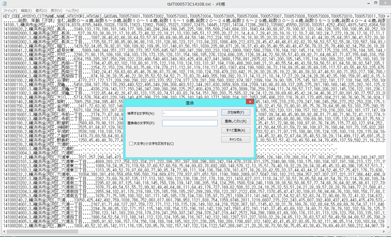

# 3.1 保育所の新設場所検討

## 3.1.1 シナリオの対象
保育所の新設を申請しようとしている業者

## 3.1.2 サービス
### 3.1.2.1 概要
保育所運営業者Xは、横浜市金沢区に保育所を新設しようとしており、その候補としてA, B, Cの3箇所を選定した。
このうち、選定した候補地は(1)立地可能か否か、(2)競合する施設があるか、等の条件から、最も適切な場所を選定したい。

### 3.1.2.2 具体的な方法
#### 3.1.2.2.1 データの取得
[横浜市金沢区のデータカタログサイト](http://www.city.yokohama.lg.jp/kanazawa/kz-opendata/kz-opendata.html) から、以下の4つのデータを取得する。

* 認可保育所
* 横浜保育室
* 認可外保育所
* 認定こども園

また、[e-stat](http://www.e-stat.go.jp/)から鈍行統計データを入手する。その手順は以下の通り。

1. 「地図や図表で見る」の中にある「地図で見る統計」を選択
2. 「データダウンロード」を選択
3. Step1で「国勢調査」の「小地域」、Step2で「年齢別」を選択
4. Step3で「神奈川県」「横浜市金沢区」を、Step4で統計データと境界データをそれぞれダウンロード

   
図 e-statトップページ

   
図 データ取得Step 1,2

   
図 データ取得Step 3,4

#### 3.1.2.2.2 データのクレンジング・前処理
入手した人口統計データには、秘匿を示す「X」とデータがないことを示す「-」という文字値が含まれている。これらを数値データから除いておく。   
また、データの第1行目にある、区全体の行を削除する。これは、このあとコロプレスマップを作成する際に、値の境界値を適切にするためである。

この後、ファイルの拡張子を「txt」から「csv」に変更する。

   
図 数値以外の値を除去

また、各列のデータ形式（数値・文字列等）を示すファイルを作成し、このファイルの拡張子を「csvt」とする。

   
図 データ形式ファイルの作成

#### 3.1.2.2.3 背景地図の取り込み
今回は、OpenSteetMapを背景地図に利用する。OpenLayersプラグインをインストールし、メニューの「Web」→「OpenLayers Plugin」→「OpenStreetMap」の順に選択して取り込む。そのあと、表示を横浜市金沢区付近に合わせる。

   
図 OpenStreemtMapの取り込み

#### 3.1.2.2.4 人口データと境界データをドッキングし、コロプレスマップを作成
メニューの「レイヤ」→「プロパティ」→「結合」を選択し、ダウンロードした境界データのshapefileと、3.1.2.2.2で編集したCSVデータをQGISウィンドウに投げ込み、ベクタ統合する。   
この両者は、KEY_CODEフィールドを利用して結合できる。

結合完了後、レイヤプロパティの「スタイル」を選択し、5歳未満の人口を示す「T000573001」カラムを選択する。色階調を調整して適用すると、OpenStreetMap上にコロプレスマップを合成できる。

   
図 コロプレスマップの合成

#### 3.1.2.2.5 保育所の位置を重ね合わせ
メニューの「レイヤ」→「レイヤの追加」→「デリミテッドテキストレイヤの追加」を選択する。   
3.1.2.2.2でクレンジング・前処理したCSVファイルを選択し、Xフィールドを「経度」、Yフィールドを「緯度」に設定する。続いて、空間参照システムを選択する画面に遷移する。今回はJGD2000を選択した。

   
図 認可保育所の位置の追加

追加した結果は、下図のようになる。

   
図 認可保育所の位置の追加結果

同様に、他の保育施設の位置も追加すると、下図のようになる。矢印を施した街区は5歳未満の児童が多いが周囲に保育施設が少ないことがわかる。

   
図 保育施設の位置の追加結果

## 3.1.3 使用するデータ
* 保育所の位置情報または住所のリスト
* 街区ごとの人口統計
* 街区の境界GISデータ

## 3.1.4 技術面での課題

## 3.1.5 ガバナンス面での課題

## 3.1.6 応用例
